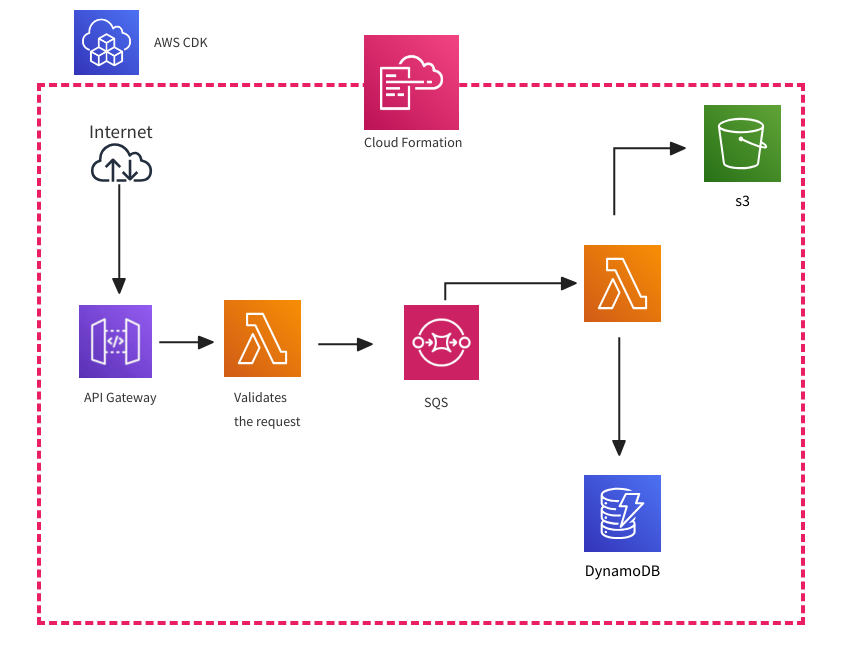

# AWS Serverless Assignment - AWS CDK . Python

## Overview
This document outlines the setup and implementation details for an AWS Serverless project using the AWS Cloud Development Kit (CDK) with Python. The project utilizes various AWS services, including CloudFormation, CloudWatch, and serverless services such as API Gateway, Lambda, DynamoDB, S3, and SQS.

## Architecture Diagram:


## Prerequisites

Ensure that you have the necessary prerequisites for AWS CDK. Refer to [AWS CDK Prerequisites](https://docs.aws.amazon.com/cdk/v2/guide/work-with.html#work-with-prerequisites) for detailed instructions.

## References

- [AWS CDK Serverless Example](https://docs.aws.amazon.com/cdk/v2/guide/serverless_example.html)
- [AWS CDK Python API Reference](https://docs.aws.amazon.com/cdk/api/v2/python/aws_cdk.html)
- [Working with AWS CDK in Python](https://docs.aws.amazon.com/cdk/v2/guide/work-with-cdk-python.html)

## Initial Project Setup

1. Install the required dependencies:

   ```bash
   python -m pip install -r requirements.txt
   ```

2. Bootstrap the AWS environment (Run only once per AWS account and region):

   ```bash
   cdk bootstrap
   ```

3. Generate the CloudFormation template:

   ```bash
   cdk synth
   ```

4. View differences between the current and previous code:

   ```bash
   cdk diff
   ```

5. Deploy the project:

   ```bash
   cdk deploy
   ```

6. Destroy the stack ( Delete the AWS resources created by your AWS CDK stack):

   ```bash
   cdk destroy
   ```


## Assumptions & decisions

- Message validation involves checking the presence and validity of all fields in the "metadata" section. Invalid messages will not proceed further.

- Used SQS in this serverless messaging application enhances reliability, scalability, and flexibility by providing a robust messaging infrastructure for communication between different components

## Future Improvements

- Add API authorization.
- Configure Cognito user pool.
- Enhance project file structure.
- Add Dead-letter queue.
- Improve response formats using a response handler.

## API Endpoints

### Send Messages to the System
```bash
Endpoint: [POST] /prod/post-message
```
Request Body:

```json
{
  "metadata": {
    "message_time": "2023-12-10T22:02:38Z",
    "company_id": "e0721e56-fb09-4273-ae74-7bcbc92d43eb",
    "message_id": "fc0daad3-4f10-4d15-b8c6-276cca111e87"
  },
  "data": {
    "order_id": "a929b88e-bc47-4f7d-9584-61c3c94ad2f2",
    "order_time": "2023-12-10T22:00:00Z",
    "order_amount": 20
  }
}
```

### Fetch a Message by Message ID
```bash
Endpoint: [GET] /prod/message/{message_id}
```
Replace `{message_id}` with the actual message ID.
